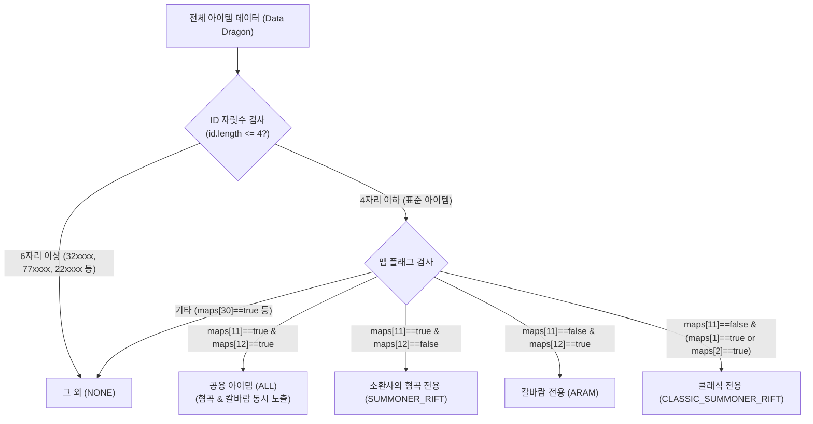

# [Concept] 아이템 맵 필터링 및 복제 아이템 격리 시스템 (Item Map Filtering System)

- **상위 분류**: 핵심 아키텍처 및 도메인 지식 ([[Indexes]])
- **연관 개념**: [[Riot_DataDragon_API]], [[MVI_Architecture]], [[Room]], [[LOL_Champion_App]]
- **최종 갱신일**: 2026-09-06

---

## 1. 개요 및 배경

`sandorln/champion` 앱은 라이엇 게임즈의 [[Riot_DataDragon_API]]로부터 리그 오브 레전드의 모든 아이템 데이터를 수집하여 표시합니다.  
그러나 시즌이 거듭되면서 라이엇 게임즈가 소환사의 협곡 외에 칼바람 나락, 아레나(Cherry), 돌격 넥서스, 특수 이벤트 모드를 지속 추가함에 따라, 동일한 이름의 아이템이 모드별 복제 ID(`32xxxx`, `77xxxx` 등)로 생성되어 상점 목록에 중복 노출되거나 타 모드 전용 템이 섞여 들어가는 문제가 발생했습니다 `[EXTRACTED]`.

이를 해결하기 위해 Riot Data Dragon의 **맵 번호(maps)** 및 **ID 자릿수 체계**를 체계적으로 분석하여, 4대 카테고리로 격리하고 중복 아이템을 제거하는 필터링 시스템을 구축했습니다 `[INFERRED]`.

---

## 2. Riot Data Dragon 맵 및 ID 체계 분석 `[EXTRACTED]`

### 2.1 맵 ID 체계 (`maps` 객체)
- **`11`**: 현대 소환사의 협곡 (Summoner's Rift)
- **`12`, `14`**: 칼바람 나락 (Howling Abyss, Butcher's Bridge)
- **`1`, `2`, `SummonersRift`**: 구 클래식 소환사의 협곡 (시즌 1~4 구형 맵)
- **`30`**: 아레나 (Arena / Cherry)
- **`21`**: 돌격 넥서스 (Nexus Blitz)
- **`453`**: 현대 공식 정규 맵 지원 플래그 (14+ 시즌 이후 도입된 표준 플래그)

### 2.2 ID 자릿수 및 접두사 체계
라이엇 게임즈는 맵 및 모드별로 고유한 ID 범위를 나누어 부여합니다:
1. **4자리 이하 정규 ID (`id.length <= 4`)**:
   - `1001` ~ `8020` 범위
   - 리그 오브 레전드 공식 정규 표준 아이템 (약 312개)
2. **`77xxxx`**: 칼바람 나락(Brawl/이벤트) 밸런스 조정용 복제 아이템 (약 150개)
3. **`32xxxx`**: 소환사의 협곡 변형 모드용 복제 아이템 (약 21개, 협곡 2개 중복 노출의 원인)
4. **`22xxxx`**: 아레나(Cherry) 증강 및 프리즘 전용 아이템 (약 137개)
5. **`66xxxx`, `44xxxx`, `12xxxx`**: 기타 특수 모드(스웜 등) 전용 파생 아이템

---

## 3. 4대 맵 필터 분류 아키텍처 `[INFERRED]`

사용자 UI는 5가지 탭(`[모두 | 소환사의 협곡 | 칼바람 협곡 | 소환사의 협곡(클래식) | 그 외]`)을 지원하며, 내부 분류 규칙은 다음과 같습니다:



### 3.1 필터별 노출 규칙
1. **소환사의 협곡 (`SUMMONER_RIFT`)**:
   - 규칙: `isStandardItem && (item.mapType == SUMMONER_RIFT || item.mapType == ALL)`
   - 효과: `32xxxx` 등 변형 복제 템이 완전히 배제되어 모든 협곡 아이템이 1개씩 단독 노출됨.
2. **칼바람 협곡 (`ARAM`)**:
   - 규칙: `isStandardItem && (item.mapType == ARAM || item.mapType == ALL)`
   - 효과: `77xxxx` 복제 아이템이 배제되어 공용 아이템과 칼바람 전용 템(수호자의 뿔피리/검 등)만 깔끔하게 노출됨.
3. **소환사의 협곡(클래식) (`CLASSIC_SUMMONER_RIFT`)**:
   - 규칙: `isStandardItem && item.mapType == CLASSIC_SUMMONER_RIFT`
   - 효과: 황금의 심장(3097), 현자의 돌(3096), 죽음불꽃 손길(3128) 등 구 맵 전용 아이템만 단독 집계됨.
4. **그 외 (`NONE`)**:
   - 규칙: `!isStandardItem || item.mapType == NONE`
   - 효과: 아레나 증강템(`22xxxx`), 모드 변형템(`32xxxx`, `77xxxx`) 등 특수 아이템들이 이곳에 독립 격리됨.

---

## 4. 데이터 영속성 및 호환성 (Room Database) `[EXTRACTED]`

`core:database`의 `ItemEntity.MapTypeEntity`는 기존 DB(`lol-champion.db`)의 정수 Ordinal 호환성을 100% 보존하도록 설계되었습니다:

```kotlin
enum class MapTypeEntity {
    ALL,                  // 0 (기존 호환)
    SUMMONER_RIFT,        // 1 (기존 호환)
    ARAM,                 // 2 (기존 호환)
    NONE,                 // 3 (기존 호환)
    CLASSIC_SUMMONER_RIFT // 4 (신규 추가, 기존 DB 영향 없음)
}
```

- 원본 SQLite DB 파일은 일절 수정하지 않고, 인메모리 필터링 및 엔티티 매핑을 통해 무결성을 유지합니다.

---

## 5. 소스 출처 (Source References)
- `core/data/src/main/java/com/sandorln/data/util/Map.kt`: 맵 판정 및 변환 매퍼
- `feature/item/src/main/java/com/sandorln/item/ui/home/ItemHomeViewModel.kt`: `isStandardItem` 기반 필터링 및 탭 제어
- `feature/item/src/main/java/com/sandorln/item/ui/dialog/ItemFilterDialog.kt`: 옵션 A (5개 태그) UI 렌더링
- `core/data/src/test/java/com/sandorln/data/util/MapTest.kt`: 맵 분류 단위 테스트
