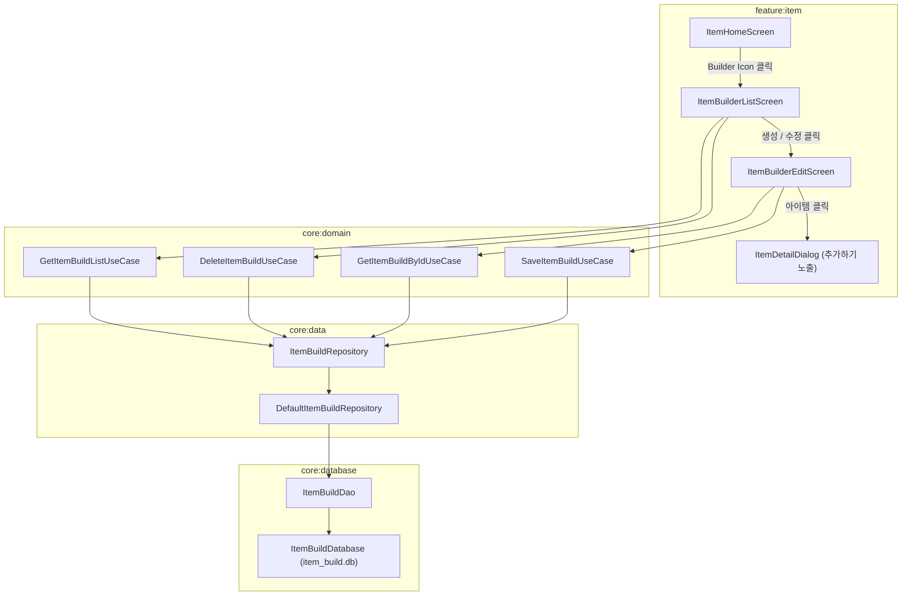

# [계획서] 아이템 빌드 시스템 (Item Build System) 설계 및 구현

- **작성 일자**: 2026-09-12
- **기준 브랜치**: develop (최신 커밋 `ca6a840`)
- **작업 브랜치**: feat/item_build_system
- **문서 상태**: 검토 대기 (승인 전 구현 금지)

---

## 1. 개발 목표 및 배경

### 1.1 배경 및 목적
- 리그 오브 레전드 유저가 자신만의 추천 아이템 빌드 세트를 작성·관리할 수 있는 독립된 **아이템 빌더 시스템**을 구축합니다.
- 기존 홈 화면의 임시 인메모리 바텀시트 방식을 벗어나, 영구 저장(Room DB), 포지션/역할군 태깅, 모션 레이아웃(Collapsible MotionLayout) 편집 화면, 카드형 목록 뷰를 갖춘 정식 기능을 제공합니다.

### 1.2 핵심 사용자 요구사항
1. **시작 기준**: `develop` 최신 커밋에서 신규 브랜치(`feat/item_build_system`) 생성 후 진행.
2. **버전별 종속 및 수량 제한 (Version-specific & Max 10 Builds)**:
   - 각 아이템 빌드는 작성 시점의 롤 버전(예: `16.17.1`)에 종속되어 저장됩니다.
   - 각 버전당 최대 10개까지만 아이템 빌드를 생성할 수 있습니다 (`count <= 10`).
   - 목록 화면에서 현재 선택된 버전의 빌드 목록 및 카운트(예: `아이템 빌드 (3/10)`)를 표시하고, 10개 초과 생성을 방지합니다.
3. **디자인 일관성 준수**: 기존 앱 디자인 시스템(`LolChampionTheme`, `Colors.Gold*`, `Colors.Blue*`, `Radius`, `TextStyles`)에 완벽히 부합하도록 구현.
4. **홈 아이템 탭 진입점**: 상단 `StickyHeader` 검색창 옆 필터 아이콘 좌/우에 독립적인 **Builder Icon** 배치.
5. **아이템 빌더 목록 화면**:
   - 뒤로가기 네비게이션.
   - 사용자가 작성한 아이템 빌드를 보여주는 가로형 카드(`ItemBuilderCard`) 리스트.
   - 카드 구성: 가로가 긴 라운드 카드, 넉넉한 가로 내부 패딩, 좌측 정렬 텍스트(제목, 포지션 태그 표기), 선택된 아이템 가로 나열, 우측 상단 더보기(More) 아이콘.
   - 더보기 메뉴: `[수정]` (편집 화면 이동), `[삭제]` (빌드 삭제).
4. **아이템 빌더 편집 화면**:
   - 뒤로가기 및 대칭되는 우측 상단 `[저장]` 텍스트 버튼 (제목, 포지션 1개 이상, 아이템 1개 이상 선택 시만 활성화, 저장 후 이전 화면 복귀).
   - **모션 레이아웃 TopBar**:
     - 챔피언 상세보기 TopBar 방식의 MotionLayout 구조.
     - 펼침(EXPANDED): 제목 입력창, 포지션 선택 영역 (Tank, Assassin 등).
     - 닫힘(COLLAPSED): 상단에 제목 텍스트 간략 표기, 스크롤/화면 터치 시 키보드 자동 숨김.
   - **상단 고정 선택 목록**: TopBar 바로 아래에 현재 선택된 아이템 목록을 가로 Row로 고정 노출 (중앙 정렬, 스크롤 가능, 비어 있어도 6개 슬롯 유지하는 Placeholder 처리).
   - **하단 아이템 탐색 목록**: 검색창 및 기존 홈 아이템 목록 재사용.
   - **아이템 상세 다이얼로그 연동**: 아이템 클릭 시 `ItemDetailDialog` 표시, 최하단에 `[추가하기]` 버튼 제공 (아이템 빌더 모드에서만 노출, 일반 홈에서는 숨김).

---

## 2. 현행 코드 분석 및 아키텍처 설계

### 2.1 데이터 영속성 (Room Database) 격리 전략
- **문제점**: 현재 `AppDatabase`는 `createFromAsset("database/lol-champion.db")` 및 `fallbackToDestructiveMigration()`으로 설정되어 있어, 향후 롤 패치로 에셋 DB 파일이 갱신되거나 스키마 변경 시 유저가 생성한 아이템 빌드 데이터가 유실될 위험이 있습니다.
- **해결책**:
  - 사용자 맞춤 데이터 전용 독립 Room DB인 **`ItemBuildDatabase` (`item_build.db`)**를 구축합니다.
  - 이로써 게임 마스터 데이터(에셋 DB)와 사용자 생성 빌드 데이터의 라이프사이클을 완벽히 격리하여 데이터 무결성을 보장합니다.

### 2.2 아키텍처 계층 구조 (MVI & Clean Architecture)


---

## 3. 상세 컴포넌트 구현 계획

### 3.1 모델 계층 (`core:model`)
- **[NEW] `core/model/src/main/java/com/sandorln/model/data/item/ItemBuild.kt`**:
  ```kotlin
  data class ItemBuild(
      val id: Long = 0L,
      val version: String = "",                          // 해당 빌드가 작성된 롤 버전
      val title: String = "",
      val positionList: List<ChampionTag> = emptyList(), // Fighter, Tank, Mage, Assassin, Marksman, Support
      val itemIdList: List<String> = emptyList(),        // 최대 6개 아이템 ID
      val createdAt: Long = System.currentTimeMillis()
  )
  ```

### 3.2 데이터베이스 계층 (`core:database`)
- **[NEW] `core/database/src/main/java/com/sandorln/database/model/ItemBuildEntity.kt`**:
  ```kotlin
  @Entity(tableName = "item_build")
  data class ItemBuildEntity(
      @PrimaryKey(autoGenerate = true)
      val id: Long = 0L,
      val version: String,
      val title: String,
      val positions: List<ChampionTag>,
      val itemIds: List<String>,
      val createdAt: Long = System.currentTimeMillis()
  )
  ```
- **[NEW] `core/database/src/main/java/com/sandorln/database/dao/ItemBuildDao.kt`**:
  - `getAllItemBuilds(): Flow<List<ItemBuildEntity>>`
  - `getItemBuildById(id: Long): Flow<ItemBuildEntity?>`
  - `insertOrUpdateItemBuild(entity: ItemBuildEntity): Long`
  - `deleteItemBuildById(id: Long)`
- **[NEW] `core/database/src/main/java/com/sandorln/database/ItemBuildDatabase.kt`**:
  - RoomDatabase 정의 (버전 1)
  - `DatabaseModule`에 DI Provider 추가.

### 3.3 데이터 & 도메인 계층 (`core:data`, `core:domain`)
- **[NEW] `core/data/src/main/java/com/sandorln/data/repository/item/ItemBuildRepository.kt`**:
  - `DefaultItemBuildRepository` 구현 및 매퍼 연결
- **[NEW] UseCase 4종 (`core:domain`)**:
  - `GetItemBuildListUseCase`
  - `GetItemBuildByIdUseCase`
  - `SaveItemBuildUseCase`
  - `DeleteItemBuildUseCase`

### 3.4 UI 계층 (`feature:item`)
#### 1) 홈 아이템 화면 진입 아이콘
- **[MODIFY] `ItemHomeScreen.kt` / `ItemStickyHeader`**:
  - 필터 아이콘 옆에 `ItemBuilder` 아이콘 추가 (`ic_pencil` 또는 전용 빌더 아이콘).
  - 클릭 시 `moveToItemBuilderListScreen()` 호출.
  - 기존 `ItemHomeScreen`의 아이템 클릭 시 `ItemDetailDialog(isBuilderMode = false)`로 호출하여 `[추가하기]` 버튼 숨김.

#### 2) 아이템 빌더 목록 화면 (`ItemBuilderListScreen`)
- **경로**: `feature/item/src/main/java/com/sandorln/item/ui/builder/list/`
- **화면 구성**:
  - **TopBar**: 뒤로가기 아이콘, "아이템 빌드", 우측 새 빌드 작성(`+`) 아이콘.
  - **Content**: `LazyColumn`
    - 빈 상태: "작성된 아이템 빌드가 없습니다. 새로운 빌드를 추가해보세요." 안내.
    - 리스트: `ItemBuilderCard` 목록.
- **`ItemBuilderCard` Widget**:
  - 가로로 길게 뻗은 카드 UI (`RoundedCornerShape(Radius.Radius04)`).
  - 가로 패딩 16dp, 세로 패딩 10dp (가로 패딩이 세로 패딩보다 큼).
  - 텍스트 좌측 정렬:
    - 제목 (`TextStyles.SubTitle01`)
    - 포지션 뱃지: 선택된 `ChampionTag` 아이콘 + 텍스트 칩 나열
  - 하단: 선택된 아이템들의 스프라이트 아이콘 가로 Row 노출.
  - 우측 상단: 제목과 대칭되는 `More` 아이콘 (`R.drawable.ic_menu_vertical`).
  - More 클릭 시 DropdownMenu `[수정]`, `[삭제]` 제공.

#### 3) 아이템 빌더 편집 화면 (`ItemBuilderEditScreen`)
- **경로**: `feature/item/src/main/java/com/sandorln/item/ui/builder/edit/`
- **화면 구성**:
  1. **TopBar & MotionLayout (`BaseContentWithMotionToolbar` 기반)**:
     - 좌측 뒤로가기, 우측 `[저장]` 텍스트 버튼.
     - 저장 버튼 활성화 조건: `title.isNotBlank() && positions.isNotEmpty() && selectedItems.isNotEmpty()`. 비활성화 시 어두운 회색, 활성화 시 골드/화이트.
     - **펼침 상태 (EXPANDED)**:
       - 빌드 이름 입력 필드 (`BaseSearchTextEditor` 스타일 또는 텍스트 입력창).
       - 포지션/역할군 선택 영역: `ChampionTag` 6종(Tank, Assassin, Fighter, Mage, Marksman, Support) 칩 다중 선택 UI.
     - **닫힘 상태 (COLLAPSED)**:
       - 상단 바 중앙/좌측에 현재 입력된 이름 텍스트 표기.
       - 스크롤 시작 또는 리스트 터치 시 소프트 키보드 자동 닫기(`focusManager.clearFocus()`, `keyboardController?.hide()`).
  2. **고정 슬롯 영역 (TopBar 직하단)**:
     - 현재 선택된 아이템 목록 가로 Row (중앙 정렬, 스크롤 가능).
     - 6개 슬롯 프레임 고정 (비어있는 칸도 Placeholder 박스로 유지).
     - 슬롯 내 아이템 클릭 시 삭제/해제.
  3. **하단 탐색 영역**:
     - 아이템 이름 검색창 (`BaseSearchTextEditor`).
     - 기존 `ItemHomeScreen`의 카테고리별(신발, 소모품, 기본, 서사, 전설 등) 그리드 아이템 목록.
     - 아이템 터치 시 `ItemDetailDialog` 표시.
  4. **`ItemDetailDialog` 변경**:
     - `isBuilderMode: Boolean = false` 매개변수 추가.
     - `isBuilderMode == true`일 때만 다이얼로그 최하단에 명시적인 **`[추가하기]`** 버튼 노출.
     - 추가 시 최대 6개 개수 검증 및 빌드 슬롯에 추가 후 다이얼로그 닫힘.

### 3.5 네비게이션 (`ItemNavigation.kt`, `MainActivity.kt`)
- `ItemBuilderListRoute`: `item_builder_list`
- `ItemBuilderEditRoute`: `item_builder_edit?buildId={buildId}` (신규 생성 시 `0`, 수정 시 해당 ID 전달)
- `MainActivity.kt`의 `NavHost`에 `itemScreens(...)` 네비게이션 그래프 등록.

---

## 4. 기능별 커밋 계획 (Granular Commits)

1. `feat : ItemBuild 도메인 모델 및 Room DB/DAO 레이어 추가`
   - `ItemBuild`, `ItemBuildEntity`, `ItemBuildDao`, `ItemBuildDatabase`, DI 모듈
2. `feat : ItemBuildRepository 및 UseCase 4종 추가`
   - Data 및 Domain 계층 비즈니스 로직
3. `feat : ItemDetailDialog 내 아이템 빌더 전용 [추가하기] 옵션 분리`
   - `isBuilderMode` 플래그 및 최하단 추가 버튼 재배치
4. `feat : 아이템 빌더 편집 화면(ItemBuilderEditScreen) 및 MotionLayout TopBar 구현`
   - 모션 레이아웃, 포지션 선택 칩, 고정 6개 슬롯, 아이템 탐색 및 저장 검증
5. `feat : 아이템 빌더 목록 화면(ItemBuilderListScreen) 및 ItemBuilderCard 위젯 구현`
   - 목록 조회, 카드형 UI, More 팝업 메뉴(수정/삭제), 네비게이션 연동
6. `feat : 홈 ItemHomeScreen에 아이템 빌더 진입 아이콘 추가 및 네비게이션 연결`
   - StickyHeader 빌더 아이콘 및 화면 전환 연동
7. `docs : 아이템 빌더 시스템 아키텍처 LLM Wiki 등록 및 인덱스 갱신`
   - `20_Wiki/Concepts/Item_Build_System.md` 작성 및 위키 린트 검증

---

## 5. 검증 계획

### 5.1 빌드 및 단위 테스트
- `./gradlew.bat :core:database:testDebugUnitTest` (DAO 및 DB 로직 검증)
- `./gradlew.bat :core:data:testDebugUnitTest` (Repository 검증)
- `./gradlew.bat :feature:item:testDebugUnitTest` (ViewModel 액션/상태 검증)
- `./gradlew.bat :app:assembleDebug` (전체 앱 빌드 검증)

### 5.2 수동 동작 확인 (Emulator UI Verification)
1. **홈 화면 진입**: 홈 아이템 탭에서 검색창 옆 빌더 아이콘 노출 확인.
2. **빌더 목록 화면 진입**: 빌더 아이콘 클릭 시 빈 화면 및 뒤로가기 동작 확인.
3. **새 빌드 생성 화면 진입**:
   - 펼쳐진 TopBar에서 제목 입력, 포지션(Tank, Assassin 등) 선택 동작 확인.
   - 스크롤 시 TopBar가 접히며 제목만 표시되고 키보드가 닫히는지 확인.
   - 상단 6개 플레이스홀더 슬롯 유지 확인.
   - 아이템 검색 및 목록에서 아이템 터치 시 `ItemDetailDialog` 최하단에 `[추가하기]` 버튼 노출 확인.
   - 아이템 추가 시 상단 슬롯에 실시간 반영 및 슬롯 탭 시 삭제 동작 확인.
   - 유효성(이름, 포지션 1개 이상, 아이템 1개 이상) 충족 시만 `[저장]` 활성화 확인.
4. **저장 및 수정/삭제 확인**:
   - 저장 후 목록 화면으로 돌아와 `ItemBuilderCard`에 제목, 포지션 태그, 아이템들이 정확히 표기되는지 확인.
   - More 아이콘 터치 -> [수정] 이동 후 데이터 정상 로드 확인.
   - More 아이콘 터치 -> [삭제] 시 목록에서 제거 및 DB 영구 반영 확인.
5. **일반 아이템 탭 회귀 테스트**:
   - 홈 아이템 탭에서 아이템 터치 시 `[추가하기]` 버튼이 노출되지 않는지 확인.

---

## 6. LLM Wiki 갱신 계획
- `20_Wiki/Concepts/Item_Build_System.md`: 아이템 빌드 시스템 아키텍처, Room 독립 DB 설계 이유, MVI 화면 흐름도 문서화.
- `20_Wiki/Indexes.md`: 마스터 인덱스에 `[[Item_Build_System]]` 등록.
- `lint_wiki.ps1`: 무결성 검증 (0 broken links, 0 orphan pages).
